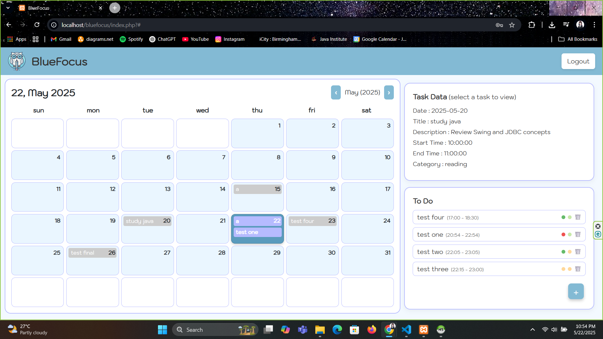
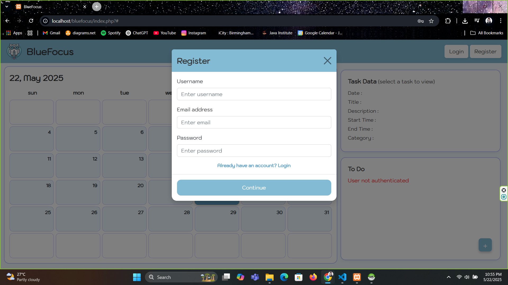
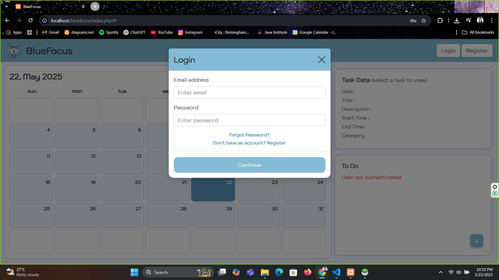
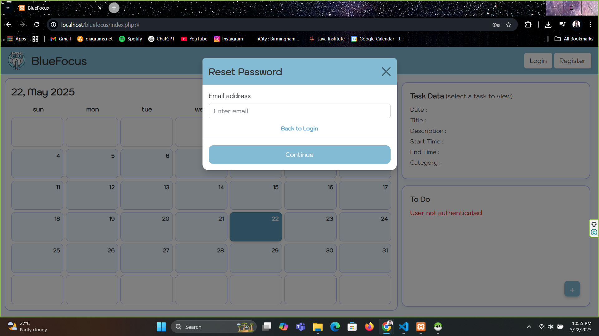
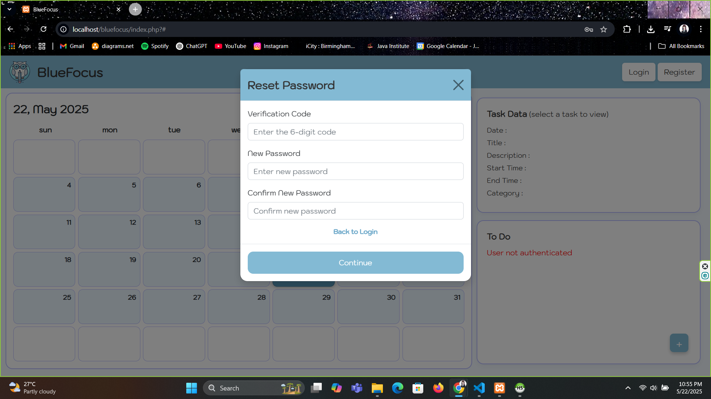
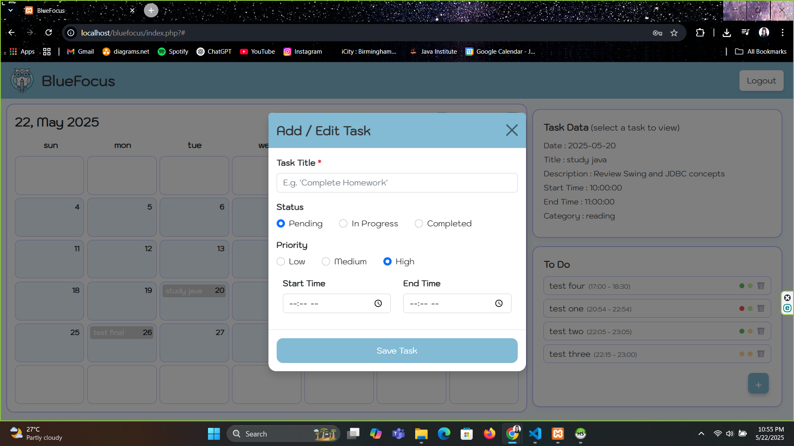
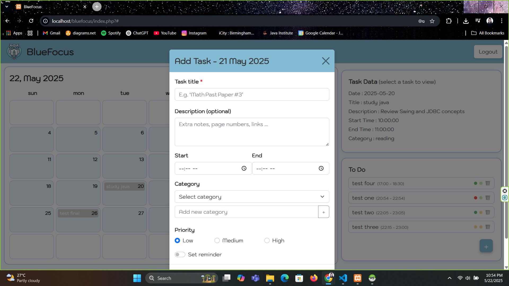

# BlueFocus — Task Scheduling Web Application


**BlueFocus** is a fully responsive, web‑based task scheduler designed to help users organize their time effectively. Developed with **HTML, CSS, JavaScript, Bootstrap, PHP, and MySQL**, BlueFocus offers session‑based authentication, a calendar task planner, a to‑do list, and secure password recovery via email (PHPMailer).

---

## 📌 Features

- **User Authentication**  
  • Registration and login  
  • Secure session management  

- **Task Management**  
  • Add, retrieve, and view tasks via a calendar interface  
  • Persist tasks in a MySQL database  

- **To‑Do List**  
  • Create, fetch, and delete to‑do items  
  • Integrated with the calendar UI  

- **Password Recovery**  
  • Email‑based password reset using PHPMailer + SMTP  
  • Secure code‑verification workflow  

- **Responsive UI**  
  • Mobile‑first design with Bootstrap  
  • Clean, user‑friendly interface  

---

## 📁 Project Structure

```text
bluefocus/
│
├── index.php                # Main application interface
├── style.css                # Custom styles
├── bootstrap.css            # Bootstrap framework
├── script.js                # Client‑side logic
│
├── connection.php           # Database connection script
├── register.php             # User registration handler
├── login.php                # Login logic
├── logout.php               # Logout functionality
├── check_session.php        # Session verification
│
├── send_reset_code.php      # Sends email verification code
├── verify_reset_code.php    # Verifies submitted reset code
│
├── save_task.php            # Save calendar tasks
├── get_task.php             # Retrieve tasks for calendar
├── get_task_detail.php      # Retrieve one task’s details
│
├── save_todo.php            # Save new to‑do item
├── get_todo.php             # Retrieve to‑do items
├── delete_todo.php          # Delete a to‑do item
│
├── PHPMailer.php            # PHPMailer core
├── SMTP.php                 # SMTP functionality
├── Exception.php            # PHPMailer exceptions
├── OAuth.php                # OAuth2 support
├── POP3.php                 # POP3 support
```

---

## 🛠️ Technologies Used

| Layer     | Stack                                   |
|-----------|-----------------------------------------|
| Front‑end | HTML5, CSS3, JavaScript, Bootstrap 4    |
| Back‑end  | PHP (Procedural)                        |
| Database  | MySQL (`tracker_db`)                    |
| Email     | PHPMailer (SMTP, OAuth)                 |

---

## 🗃️ Database

**Database name:** `tracker_db`

Suggested tables:

| Table            | Purpose                              |
|------------------|--------------------------------------|
| `users`          | Stores user credentials & metadata   |
| `tasks`          | Stores calendar tasks                |
| `todos`          | Stores to‑do‑list items              |
| `password_resets`| Stores password‑reset codes (opt.)   |

> Import the schema before first run.

---

## 🚀 Getting Started

1. **Clone or download** this repository.  
2. Import the SQL schema for `tracker_db`.  
3. Update database credentials in `connection.php`:  
   ```php
   $conn = new mysqli('localhost', 'root', '', 'tracker_db');
   ```  
4. Configure SMTP in `send_reset_code.php`:  
   ```php
   $mail->Host     = 'smtp.yourprovider.com';
   $mail->Username = 'you@example.com';
   $mail->Password = 'your_app_password';
   $mail->Port     = 587;
   ```  
5. Launch a local server (XAMPP, WAMP, MAMP).  
6. Browse to `http://localhost/bluefocus/index.php`.  

---

## 📧 Email Configuration Tips

- Use providers like **Gmail**, **SendGrid**, or **Mailgun**.  
- For Gmail, enable *App Passwords* and 2‑factor authentication.

---

## 📱 Screenshots

### Dashboard


### Register


### Login


### Verification Email Sent


### Reset Password


### Add To-Do


### Add Task


---

## 📃 License

This project is provided for educational and personal use. For commercial use, please contact the author.

---

## 👨‍💻 Author

Created by **Thedara Sasindi**  
*Ungergraduate Full‑stack Software Engineering*  
GitHub: <https://github.com/sasindi22>  
Email: thedarasasindi@gmail.com
